# Hamaker 2.3 — User Manual

*A colloidal stability toolkit*

## Table of Contents

- [Introduction](#introduction)
  - [How to cite](#how-to-cite)
- [The interface](#the-interface)
  - [Menus](#menus)
    - [Double click files to open](#double-click-files-to-open)
  - [Controlling the plot](#controlling-the-plot)
  - [The plot pane](#the-plot-pane)
  - [Creating and modifying series](#creating-and-modifying-series)
- [Theoretical background](#theoretical-background)
  - [Interaction calculations](#interaction-calculations)
  - [Stability evaluation](#stability-evaluation)
- [The built-in models](#the-built-in-models)
  - [Dispersion (vdW)](#dispersion-vdw)
    - [Hamaker](#hamaker) · [Gregory](#gregory) · [Vincent](#vincent) · [Effective](#effective)
  - [Electrostatic](#electrostatic)
    - [HHF](#hhf) · [LSA](#lsa)
  - [Steric](#steric)
    - [Bergstrom](#bergstrom)
- [Writing plug-in models](#writing-plug-in-models)
  - [Setup your environment](#setup-your-environment)
  - [Implement the interaction functions](#implement-the-interaction-functions)
  - [Compile the plugin](#compile-the-plugin)
- [Annex](#annex)
  - [Annex 1: Excel data format](#annex-1-excel-data-format)
  - [Annex 2: API definition](#annex-2-api-definition)
- [Version history](#version-history)
- [References](#references)

---

#  Introduction

Hamaker 2 is a program for the prediction of the colloidal stability of suspensions. It allows the study of interaction between dissimilar particles as a function of any variable of the colloidal system, therefore enabling scientists and engineers to understand what aspects control the stability (or instability) of their systems and how to achieve the required degree of stability.

# How to cite

When publishing results obtained using the Hamaker software package, please cite the following reference:

U. Aschauer; O. Burgos-Montes; R. Moreno; P. Bowen, Journal of Dispersion Science and Technology, 32(4), 470-479 **(2011).**

# The interface

After double clicking the "Hamaker2" application, you will see the main window. The Hamaker 2 window is divided into three main parts. In the topmost part one controls the plot display and axes. Below follows the plotting pane where the graphics are displayed (and manipulated for the 3D case). The bottom most part finally allows to control the different series to display. Contrary to Hamaker 1.x it is now possible to control all aspects of the system for each of the series.

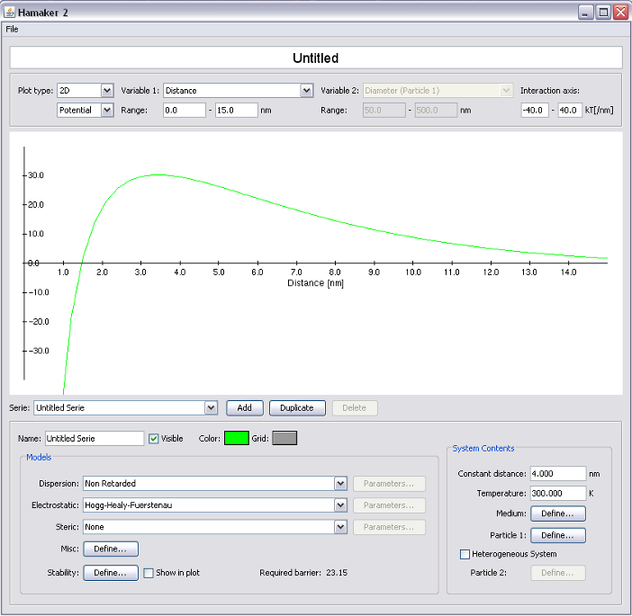

##  Menus

For the moment Hamaker 2 is mostly controlled trough elements in the main window and contains only one menu with the most essential items.

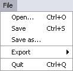

-   "***Open...***" allows reopening a previously saved ".ham2" file. The same can also be achieved by double clicking a ".ham2" file (see below).

-   "***Save***" will save the currently open file to disk. If no location has been specified (by previously saving to disk or opening from disk), a prompt for the location will appear.

-   "***Save as...***" will save the currently open file to disk as well, however the location prompt will appear in any case, allowing to save to a different location (i.e. preventing a previous version of the file from being overwritten).

-   "***Export***" will save the file in a different format, readable by another application. The following choices are available:

    -   "***Excel***": Saves the data in a tab separated text format, which can be read using Microsoft Excel. The data format can be found in the annex.

-   "***Quit***" will terminate Hamaker 2.0. In case there are unsaved changed you will be prompted to save your document.

### Double click files to open

In order to open ".ham2" files by double clicking them, the ".ham2" file type has to be associated with the "Hamaker2" application. This step is operating system dependent.

-   On Microsoft Windows: Right click the ".ham2" file and choose "Open with..." from the popup menu. Then browse for the Hamaker2.exe application on your hard drive and select the "Always use the selected program to open this kind of file" checkbox.

-   On Mac OS X: Right click the ".ham2" file and choose "Get Info". Under "Open With:" select "Other" then browse to the Hamaker2.app application on your hard drive and then click the "Change All..." button.

-   On Linux: Window system dependent. Please consult your systems manual for details.

> Now you can open ".ham2" files by double clicking the file.

##  Controlling the plot

The plot appearance can be controlled in the following panel.

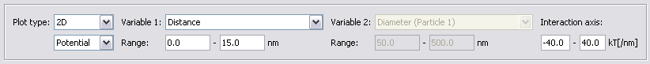

The following options are available:

-   "***Plot type***":

    -   "***2D***": plots the interaction potential as a function of a single variable (specified using the pull-down menu "Variable 1", see below).

    -   "***3D***": plots the interaction potential as a function of two variables (specified by the two pull-down menus "Variable 1" and "Variable 2" respectively) as a surface.

    -   "***Potential***": plots the interaction potential on the y-axis (normalized by kT)

    -   "***Force***": plots the force (first derivative of the potential with respect to separation) on the y-axis (normalized by kT/nm)

-   "***Variable 1***": The (primary) plot variable. In case of a 2D plot the interaction potential will be plotted as a function of this variable. In case of a 3D plot this variable will be the first coordinate axis.

    -   "***Range***": gives the range of the first variable, which will be calculated.

-   "***Variable 2***": The secondary plot variable. Only active in case a 3D plot is selected.

    -   "***Range***": gives the range of the second variable.

-   "***Interaction axis***": gives the range of the interaction potential to be displayed. Use this to cap the plot and not to display very large values (interaction minima).

## The plot pane

The plot pane is where the currently active plot is displayed (and modified in the case of a 3D plot).

  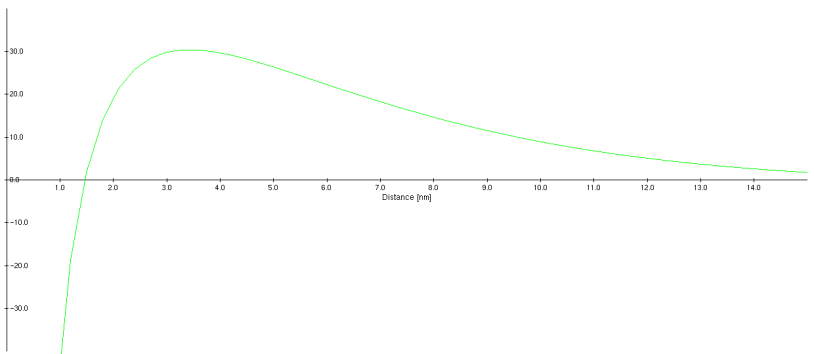
  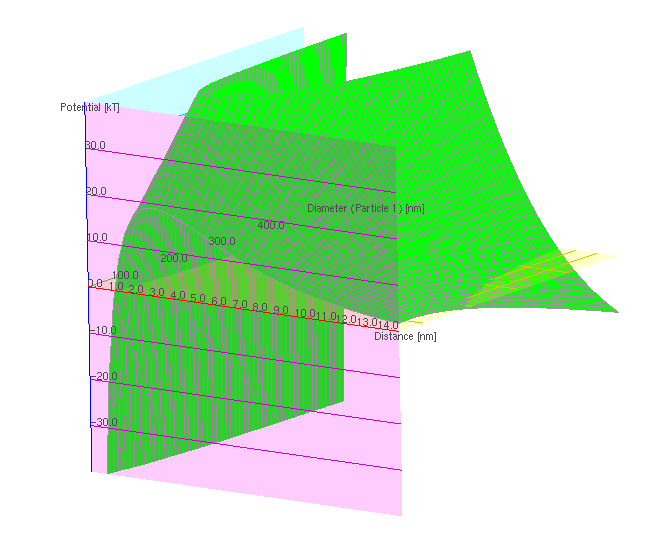

A 2D plot shows the interaction potential as a function of the selected "Variable 1" in the given range. A 3D plot shows the interaction potential as a function or "Variable 1" and "Variable 2" in the selected ranges respectively. In the case of a 3D plot the following actions can modify the way the plot is viewed:

-   Drag left mouse button: Translate the graph in the window

-   Drag right mouse button: Rotate the graph. The rotation is done using trackball mode. This means that when dragging in the center of the screen the graph will be rotated around the two axes lying in the screen plane whereas close to the borders of the screen a rotation around the axis normal to the screen will be performed.

-   Mouse wheel: Zoom in or out of the graph.

## Creating and modifying series

Series are created and modified in the bottom-most section of the window.

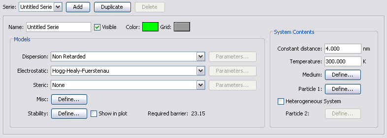

-   The popup menu "***Serie***" controls on which of the series the modifications will be applied.

-   By clicking the "***Add***" button you can add a new serie. The new serie will be placed at the end and be named "Untitled Serie N" where N is a consecutive number.

-   The "***Duplicate***" button creates a copy of the currently active serie. The new serie will be names "Copy of X" where X is the name of the currently active serie.

-   The "***Delete***" button is only active when more than one serie exist. It will remove the currently active serie.

The box below contains all parameters about a serie, which can be changed.

-   "***Name***": the name used to identify the serie as it will be displayed in the "Series:" popup menu and in the output files.

-   "***Visible***": controls if the serie is displayed or not.

-   "***Color***": Depending on the type of the plot this parameter controls:

    -   2D: the line color of the plot

    -   3D: the surface color of the plot

-   "***Grid***": has an effect only in the 3D plot. Will change the color of the line grid displayed on top of the surface.

-   "***Dispersion***": will control which dispersion model is used. For a description of the built-in models see below. Plug-in models should provide their own documentation. If a model requires additional parameters, these can be accessed using the "***Parameters...***" button.

-   "***Electrostatic***": will control which electrostatic model is used. For a description of the built-in models see below. Plug-in models should provide their own documentation. If a model requires additional parameters, these can be accessed using the "***Parameters...***" button.

-   "***Steric***": will control which steric model is used. For a description of the built-in models see below. Plug-in models should provide their own documentation. If a model requires additional parameters, these can be accessed using the "***Parameters...***" button.

-   "***Misc***": gives the possibility to include interaction potentials, which are not of dispersion, electrostatic or steric nature (i.e. magnetic interaction). There are no built-in models of this kind, only plug-ins will show up. Clicking the "***Define...***" button will show the following dialog.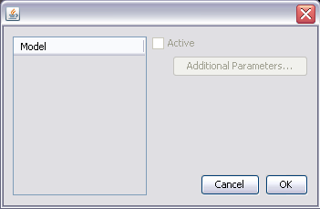

     -   On the left the available models are displayed. Upon selecting them they can be activated (by checking the "***Active***" box) or deactivated and if they require additional parameters, the "***Additional Parameters...***" can be clicked to set these.

-   "***Stability***" will allow setting the parameters for the stability calculation using the following dialog. 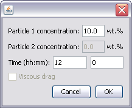

    -   The "***concentrations***" of particles of type 1 and 2 (for a heterogeneous system) are given in wt. % calculated according to \
    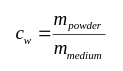

    -   "***Time***" defines the time for which the suspension should remain stable.

    -   "***Viscous Drag***" finally allows selecting a calculation model including viscous drag. For more detail on the stability calculations see further down.

-   The "***Show in plot***" box controls if the stability line is displayed in the plot (same color as the serie but dashed).

-   "***Required barrier***" is the value of the interaction potential barrier required to prevent agglomeration in the specified system for the specified time.

-   "***Constant distance***" is the distance to be used for interaction potential calculations in case distance is **not** selected as a plot variable.

-   The temperature of the system is given by "***Temperature***".

-   The "***Medium***" button allows defining the properties of the suspension medium using the following dialog. 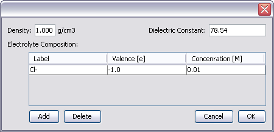

    -   "***Density***" defines the density of the fluid medium and "***Dielectric Constant***" gives its dielectric constant. The table below controls the contents of the system. Species may be added and removed using the "***Add***" and "***Delete***" buttons. Each entry has a "***Label***" which is for ease of identification only. The "***Valence***" gives the species charge whereas the "***Concentration***" gives the molar concentration of the species.

-   The "***Particle 1 Define...***" and "***Particle 2 Define...***" buttons allow defining the particles in the system using the following dialog. Please note that the button for particle 2 is only active if the "***Heterogeneous System***" box is ticked. 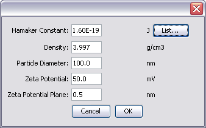

    -   Parameters to be given are the "***Hamaker Constant***", the "***Density***", the "***Particle Diameter***", the "***Zeta Potential***" as well as the "***Zeta Potential Plane***" which is the distance from the surface where the zeta potential is measured. The "***List...***" button allows you to select the often hard to find Hamaker constants from a web-based repository.

# Theoretical background

## Interaction calculations

Hamaker 2.0 calculates the interparticle interaction within the Derjaguin, Landau, Verwey and Overbeck (DLVO) model, adding contributions for interactions other than van der Waals and electrostatic interaction such as steric interaction models and others. The basic equation describing the total interparticle interaction *V* in Hamaker 2 is as follows:

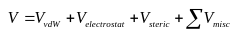

*V~vdW~*, *V~electrostat~* and *V~steric~* being the contributions of the attractive van der Waals, the electrostatic and steric interactions respectively. The sum over the *V~misc~* interactions allows adding a collection of other interactions depending on the system in question. For example one could add magnetic interaction forces for particles exhibiting this property.

##  Stability evaluation

The stability of a colloidal suspension is evaluated according to the model published by Israelachvili [1]. A particle of diameter *d* and density *ρ~p~* in a suspension at temperature *T* will have a mean Brownian velocity given by:

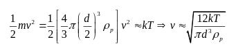

Where *k* is the Boltzmann constant. At a given suspension concentration *c* (in wt. % s/l) the number of particles per unit volume *N~p~* is given as a function of the densities of the particles *ρ~p~* and the medium *ρ~m~* as well as the particle diameter *d* by dividing the total mass of all particles *m~pT~* by the mass of a single particle *m~p~*.

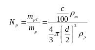

For a binary system the number of particles per unit volume is given by the sum of the two particle contributions:

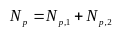

The number of particles along one edge of the unit volume is given by the cubic root of *N~p~*, the inverse of which finally gives the spacing between two particles along the edge. This is considered as the closest interparticle spacing *d* at equilibrium.

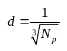

In order for two particles to collide, the particle has to travel the interparticle distance *d* which at its mean Brownian velocity *v* will require a time *Δt*, thus the time between collisions. The collision frequency *f~c~* is then given by the inverse of *Δt*.

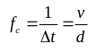

Where for a binary system the mean velocity is considered:

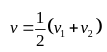

The probability *p* of two particles having a kinetic energy allowing them to overcome an energy barrier *ΔW* is given by

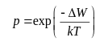

*k* being the Boltzmann constant and *T* the temperature. Within a time *t*, *t·f~c~* collisions will occur, which means that for none of these collisions being energetic enough to overcome the barrier is, a minimum value for *ΔW* in order to avoid energetic collisions and thus agglomeration can be calculated as:

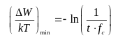

#  The built-in models

## Dispersion (vdW)

The user can choose from the classical unretarded interaction model by Hamaker [2] or the retarded models by Gregory [3] and Vincent [4]. In all models *A~H,eff~* is the effective Hamaker constant for the system, *h* is the particle surface-surface separation and *a~1~* and *a~2~* are the particle radii respectively.

### Hamaker

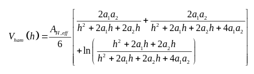

### Gregory

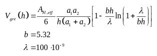

### Vincent

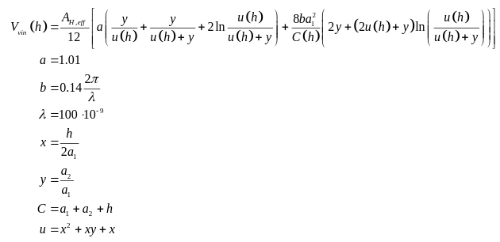

### Effective

This model implements the effective distance dependent approach for the Hamaker constant based on dielectric constants and refractive indices [5]. The Hamaker constant is calculated as given by the following equation and then used in the unretarded Hamaker model:

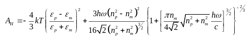

## Electrostatic

The Hogg-Healy-Fürstenau (HHF) [6] as well as the Linear Superposition Approximation (LSA) is implemented. In all models the ionic strength *I~c~* and the inverse Debye length *κ* are calculated as:

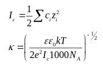

Where *c~i~* and *z~i~* are the concentration and valence of ions in solution respectively, *ε* and *ε~0~* the dielectric constant and the electric constant respectively, *k* Boltzmann's constant, *T* the temperature, *e* the elementary charge and *N~A~* Avogadro's number.

The surface potential *ψ* is calculated from the measurable zeta potential ζ via

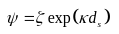

ds being the distance from the surface where the zeta potential is measured.

### HHF

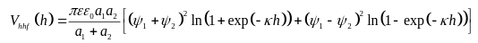

### LSA

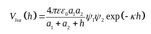

##  Steric

The close to hard wall model introduced by Bergstrom[7] is implemented.

### Bergstrom

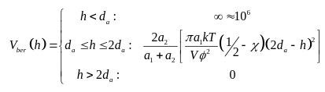

The parameter *d~a~* represents the thickness of the adsorbed layer, and *φ* the volume fraction of adsorbent in the adsorbed layer. V is the molecular volume of the solvent and χ the solvent adsorbent interaction parameter.

#  Writing plug-in models

The range of interaction models available in Hamaker 2 can easily be extended by the user trough plug-in modules. The modules are compiled java classes, implementing a certain interface. The following is a short description on how to proceed to implement a new plug-in.

## Setup your environment

Your computer will need to have a JDK (java development kit) installed.

## Implement the interaction functions

Lets assume you want to write a new dispersion interaction model. Our awesome new model can be described by

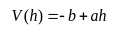

which corresponds to the not very physical case of an linearly increasing potential. As you can see we will need to implement two parameters *a* and *b*, which are internal to our model.

Using your favorite text editor create a new java file, i.e. "LinearDispersion.java".

All plugins depend on a certain number of standard java classes. So lets start by importing these:

```java
import java.util.ArrayList;
import java.io.BufferedWriter;
import java.io.BufferedReader;
import java.io.IOException;
```

We then define the class, which in this case implements "DispersionInteractionModel". If you were to write another type of model, the classes would implement "ElectrostaticInteractionModel", "StericInteractionModel" or "MiscInteractionModel" respectively.

```java
public class LinearDispersion implements hamaker2.models.dispersion.DispersionInteractionModel {
    double a, b;
    boolean needs_save;
}
```

We define the two needed variables a and b as double precision real numbers just inside the class. We also define the variable needs_save, which indicates if the variables a and b have changed and need to be saved.

Within this class we implement a certain number of functions:

```java
public LinearDispersion() {
    /* default values: potential raises linearly from -5kT and becomes repulsive at 10nm */
    a = 5/1E-8;
    b = 5;
    needs_save = false;
}
```

Is the constructor and should initialize all internal variables your plug-in requires to their default values.

```java
public String name() {
    return "Linear Dispersion Interaction";
}
```

Returns the name of the interaction function (displayed in the corresponding Hamaker 2 menu once the plugin is installed).

```java
public String reference() {
    return "Hyper Colloids, 12(4), 150-153, (2008)";
}
```

Return the reference, where the model can be found. This is displayed as the user hovers over the corresponding menu item.

```java
public boolean additionalParameters() {
    return true;
}
```

If the model has additional parameters, which can be set using the "more dialog" (see below), this function should return true.

```java
public void showMoreDialog() {
    MoreDialog dialog = new MoreDialog();
}
```

We simply call the more dialog, which is defined further down in the class.

```java
public double interactionPotential(hamaker2.Serie serie) {
    return -b + a * serie.getDistance();
}

public double interactionForce(hamaker2.Serie serie) {
    return a;
}
```

These are the main workhorses of the plug in: They return the interaction potential and the force respectively. The built-in models implement the force as analytic functions; plug-ins may also use a numerical way to obtain the force, which is however discouraged for reasons of precision. See annex 2 for a list of function exported by Serie and contained objects, which are likely to be used in the calculation of the potential and force.

```java
public ArrayList plotVariables() {
    return new ArrayList();
}
```

Return an array of variables against which the user may plot. We don't want to plot against either a or b so we return an empty array.

```java
public boolean getNeedsSave() {
    return needs_save;
}
```

We return if the model parameters have changed and if as a consequence saving is required (i.e. "Do you want to save" dialog upon closing of Hamaker 2).

```java
public void save(BufferedWriter output) {
    output.write(String.valueOf(a));
    output.newLine();
    output.write(String.valueOf(b));
    output.newLine();
}

public void load(BufferedReader input) {
    a = hamaker2.Utils.StringToDouble(input.readLine());
    b = hamaker2.Utils.StringToDouble(input.readLine());
}
```

Here we write and read the model parameters to or from a file. It is important to write and read in the same sequence.

```java
public LinearDispersion duplicate() {
    LinearDispersion copy = new LinearDispersion();
    copy.a = a;
    copy.b = b;
    copy.needs_save = true;
    return copy;
}
```

To allow for "deep" copying of series the "duplicate" function is used. Here the plugin should create a new instance of itself and fill the values by making a deep copy of itself. Objects (if any) should be cloned, while primitive values (double, int, boolean) may be assigned as usual using the "=" operator. The "needs_save" variable is to be set to "true" as duplicating consists in an operation requiring saving of data.

The following is a very simple implementation of the more dialog. A complete description is beyond the scope of this manual, however a programmer proficient with java and swing should not have any problems with this code. Please refer to comments in the code for basic explanations.

```java
private class MoreDialog extends javax.swing.JDialog {

    public MoreDialog() {
        // initialize the dialog and components
        super((java.awt.Frame) null, true);
        javax.swing.JLabel a_label = new javax.swing.JLabel("A:");
        javax.swing.JLabel b_label = new javax.swing.JLabel("B:");
        a_field = new javax.swing.JFormattedTextField(String.valueOf(a));
        b_field = new javax.swing.JFormattedTextField(String.valueOf(b));

        // create the ok and cancel buttons and attach the corresponding actions
        javax.swing.JButton okButton = new javax.swing.JButton("OK");
        okButton.addActionListener(new java.awt.event.ActionListener() {
            public void actionPerformed(java.awt.event.ActionEvent evt) {
                // extract changed values
                a = hamaker2.Utils.StringToDouble(a_field.getText());
                b = hamaker2.Utils.StringToDouble(b_field.getText());
                // close the dialog
                setVisible(false);
                // notify hamaker 2 that we need to save new data
                needs_save = true;
            }
        });

        javax.swing.JButton cancelButton = new javax.swing.JButton("Cancel");
        cancelButton.addActionListener(new java.awt.event.ActionListener() {
            public void actionPerformed(java.awt.event.ActionEvent evt) {
                // simply close the dialog
                setVisible(false);
            }
        });

        // create a simple grid layout and pack in the components
        java.awt.GridLayout layout = new java.awt.GridLayout(3, 2);
        getContentPane().setLayout(layout);
        getContentPane().add(a_label);
        getContentPane().add(a_field);
        getContentPane().add(b_label);
        getContentPane().add(b_field);
        getContentPane().add(cancelButton);
        getContentPane().add(okButton);
        pack();

        // set the dialog to destroy when closing
        setDefaultCloseOperation(javax.swing.WindowConstants.DISPOSE_ON_CLOSE);
        // make it visible
        setVisible(true);
    }

    // fields that need to be accessible in the action methods
    private javax.swing.JFormattedTextField a_field;
    private javax.swing.JFormattedTextField b_field;
}
```

## Compile the plugin

Place the "LinearDispersion.java" file in the "plugins" directory within your Hamaker2 directory. Now open a terminal, navigate to your Hamaker2/plugins directory. Then execute on windows:

```
C:\Program Files\Java\jdk**VERSION**\bin\javac -classpath "plugin development\classes" LinearDispersion.java
```

or on mac/linux:

```
javac --classpath "plugin development/classes" LinearDispersion.java
```

If your code contains no errors, you should get a file LinearDispersion.class in the plugins directory and upon starting of Hamaker2 you should see your brand new plugin in the corresponding menu.

#  Annex

## Annex 1: Excel data format

For a 2D plot the data will be saved as follows (v~i~ is the ith variable value and P~ij~ is the interaction potential of the ith variable value for the jth serie):

| Variable Name | Name Series 1 | Name Series 2 | ... |
|:---|:---|:---|:---|
|v~1~|P~11~|P~12~|...
|v~2~|P~21~|P~22~|...
|...|...|...|...
|v~n~|P~n1~|P~n2~|...

For a 3D plot the data is saved as follows (v~1i~ is the ith variable value of variable 1, v~2j~ is the jth variable value of variable 2 and P~ij~ is the potential for the ith and jth variable value for variable 1 and 2 respectively):

|**Series 1 Name**| | | | | | |
|---|---|---|---|---|---|---|
| | |**Variable 1 Name**| | | | |
| | | |v~11~|v~12~|...|v~1n~|
| |**Variable 2 Name**|v~21~|P~11~|P~21~|...|P~n1~|
| | |v~22~|P~12~|P~22~|...|P~n2~|
| | |...|...|...|...|...|
| | |v~2m~|P~1m~|P~2m~|...|P~nm~|
| | | | | | | |
|**Series 2 Name**| | | | | | |
|...| | | | | | |

This means that there is one block per series. In the block the top left cell is the series name. Then follows in the 3^rd^ line and 2^nd^ column the variable values with their respective names in line 2 and column 1 respectively. The inside of the matrix then contains the values for each variable value pair.

##  Annex 2: API definition

### hamaker2.Serie

```java
// return the interparticle distance in m
public double getDistance();

// return the temperature in K
public double getTemperature();

// returns if the system contains two types of particles
public boolean getHeterogeneous();

// return the particle 1 or 2 respectively
public hamaker2.Particle getParticle1();
public hamaker2.Particle getParticle2();

// return the medium
public hamaker2.Medium getMedium();
```

### hamaker2.Particle

```java
// returns the hamaker constant in J
public double getHamakerConstant();

// returns the density in kg/m3
public double getDensity();

// returns the active particle size distribution
public ParticleSizeDistribution getSelectedSizeDistribution();

// returns the zeta potential in V
public double getZetaPotential();

// returns the origin of the electrostatic interaction wrt the surface in m
public double getElectrostaticOrigin();
```

### hamaker2.Medium

```java
// return the density in kg/m3
public double getDensity();

// return the dielectric constant
public double getDielectricConstant();

// returns the number of species in the electrolyte
public int getNumElectrolyteComponents();

// returns the label, valence and concentration of electrolyte component i
// according to java standard (i=0..n-1) where n = getNumElectrolyteComponents();
public String getElectrolyteComponentLabel(int i);
public double getElectrolyteComponentValence(int i);
public double getElectrolyteComponentConcentration(int i);
```

### hamaker2.models.GeometryClass

```java
// definitions of the geometry classes
public static final GeometryClass kGeometryClass_Sphere_Sphere;
public static final GeometryClass kGeometryClass_Sphere_Plate;
```

### hamaker2.models.plotVariable

```java
// create a new plot variable
public PlotVariable(String id, String name, String unit, double min, double max, double factor, String format);
```

### hamaker2.models.plotVariableProvider

```java
public interface PlotVariableProvider {
    public ArrayList<PlotVariable> plotVariables();
    public double getPlotVariable(String id);
    public void setPlotVariable(String id, double value);
}
```

#  Version history

## Version 2.0.0

Initial release

## Version 2.1.0

Bug fixes:

-   Fixed a "shallow-copy" bug in models with "More" dialogs, which resulted in parameters to change for all series simultaneously when changing one serie.

-   Fixed a bug in the formatting of the required barrier when changing stability parameters.

New features:

-   Added force plotting

-   Added the "Effective" Dispersion model, which calculates Hamaker constants on the fly based on dielectric constants and refractive indices.

## Version 2.2.0

Bug fixes:

-   Fixed a bug in the plot variables implementation. Now all plot variables are recognized and treated correctly. The API interface for the interaction model changed slightly, existing plug-ins will have to be adapted.

-   Changed online Hamaker constant list to reflect new server URL.

Improvements:

-   The program now remembers the directory last used for open/save operations.

-   Improved plotting accuracy

-   GUI improvements

New features:

-   Added support for different geometry classes. Currently implemented are Sphere-Sphere and Sphere-Plate. Added the Sphere-Plate formulation for all built-in models.

-   Brush steric model implemented

-   Added viscous drag in stability estimation

-   Medium dialog box now prints the Debye length for a given temperature

-   Numerical values of extrema are shown

-   Crosshair in plot for easy extraction of numeric values

## Version 2.2.1

Bug fixes:

-   Fixed a bug that would prevent models in the Misc dialog to be changed more than once per session.

-   Fixed missing classes in API

## Version 2.3 (first open source release)

Bug fixes:

-   

Improvements:

-   Implemented check that no two models have the same identifier. This prevents problems when plugins with same identifiers as existing models are added.

-   Plugins can now be loaded from java archive (jar files), which allows bundling GUI elements and model code into a single file.

-   Updated plugin compile section in user guide.

New features:

-   Particle size distributions
-   First implementation of the YODEL model [8]


#  References

[1] J. N. Israelachvili, *Intermolecular and Surface Forces*. Academic Press: San Diego, 1991.

[2] H. C. Hamaker, *Physica* **1937,** 4, 1058-1072.

[3] J. Gregory, *Journal of Colloid and Interface Science* **1981,** 83, (1), 138-145.

[4] B. Vincent, *Journal of Colloid and Interface Science* **1973,** 42, (2), 270-285.

[5] W. B. Russel; D. A. Saville; W. R. Schowalter, *Colloidal Dispersions*. Cambridge Press: Cambridge, U.K., 1985.

[6] R. Hogg; T. W. Healy; D. W. Fuerstenau, *Transactions of the Faraday Society* **1966,** 62, (522P), 1638-1651.

[7] L. Bergstrom; C. H. Schilling; I. A. Aksay, *Journal of the American Ceramic Society* **1992,** 75, (12), 3305-3314.

[8] R. J. Flatt; P. Bowen, *Journal of the American Ceramic Society* **2006,** 89, (4), 1244-1256
